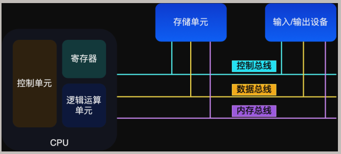

## 1.1 

### 冯诺依曼模型  
* 中央处理器（CPU）
  * 控制单元
  * 寄存器
  * 逻辑运算单元
* 内存
* 输入设备
* 输出设备
* 总线
  * 控制总线
  * 数据总线
  * 内存总线

#### 内存
 
 * 程序和数据都存在内存里，存储区域是**线性**的  
 * 数据存储的单位：**二进制位(bit)**  
 * 最小存储单位：**字节 (byte)**  
 * 1字节等于8位

#### 中央处理器

32位和64位区别
* 32位CPU一次计算4个字节(32位)；
* 64位CPU一次计算8个字节(64位)；

##### 控制单元
>负责控制CPU工作
##### 逻辑运算单元
>负责计算
##### 寄存器
存储计算时的数据  
分类  
* 通用寄存器：存放需要运算的数据  
* 程序计数器：存储下一条指令的**地址**  
* 指令寄存器：存放程序计数器指向的指令  

#### 总线

* 地址总线
  * 指定CPU将要操作的内存地址
* 数据总线
  * 用于读写内存数据
* 控制总线
  * 用于发送和接受信号

CPU读写内存数据过程：  
1. 通过地址总线指定内存地址  
2. 通过数据总线传输数据

#### 输入输出设备

键盘，鼠标，显示屏。
>注：按下按键是需要和CPU进行交互的，可能用到控制总线。

### 线路位宽与CPU位宽

>注：推荐笔记：[寻址空间](https://www.coonote.com/os/cpu-addressing-space.html)

线路位宽是地址总线的位宽，体现了cpu的寻址能力。线路位宽的最小单位为字节。  
* 具有12位宽地址总线的cpu的寻址能力为2^12Byte=4KB。  
* 只有一根地址总线的cpu的寻址能力为两个存储单元。存储单元为一个字节，由8位二进制进行表示。每个单元有一个地址，可表示为二进制整数。

CPU位宽不应小于线路位宽。

### 程序执行的基本过程

CPU执行程序的过程如下：  
1. CPU读取**程序计数器**的值，获取指令的内存地址，然后使用**控制单元**操作**地址总线**指定需要访问的内存地址，通知内存设备准备数据，数据准备好后通过**数据总线**将指令数据传给CPU，CPU收到指令数据后将其存入到**指令寄存器**；  
2. CPU分析**指令寄存器**中的指令，确定指令的类型和参数  
   * 计算类型指令：给逻辑运算单元
   * 存储类型指令：给控制单元
3. CPU执行完指令后，**程序计数器**值自增，以指向下一条指令。  
   >32位CPU的指令是4个字节，需要4个内存地址存放，因此**程序计数器**值自增4；

总结：⼀个程序执⾏的时候，CPU 会根据程序计数器⾥的内存地址，从内存里面把需要执⾏的指令读取到指令寄存器里面执行，然后根据指令长度⾃增，开始顺序读取下⼀条指令

CPU会不断的循环执行指令直到程序执行结束，该过程为**CPU的指令周期**。

### a=1+2执行具体过程

数据和指令是分开存放的，存放指令区域的地方称为**正文段**
对于数据来说，int占4字节，char占1字节。

MIPS指令集

指令周期

1. Fetch：取指令
2. Decode：指令译码
3. Execution：执行指令
4. Store：数据回写

指令类型：  
* 数据传输类型：store, load, mov
* 运算类型：add, mul, divide
* 跳转类型：if-else, switch-case
* 信号类型：trap
* 闲置类型：nop

指令执行速度  

1GHz的CPU：时钟频率1G，一秒产生1G次数脉冲信号，每一次脉冲高低电平的转换就是一个**时钟周期**。

一个时钟周期内CPU只能完成一个基本动作，时钟频率越高，工作速度就越快。

多数指令不能在一个时钟周期完成

>CPU执行时间=CPU时钟周期数 X 时钟周期时间

时钟周期时间=1/主频=1/2.4G

时钟周期数=指令数X每条指令的平均时钟周期数

### 总结
>问题：64位相比32位CPU的优势在哪吗？64位CPU的计算性能一定比32位CPU高很多吗？
* 大寻址空间
* 大计算数字

硬件的64位指的是CPU的位宽，软件的64位指的是指令的位宽。

